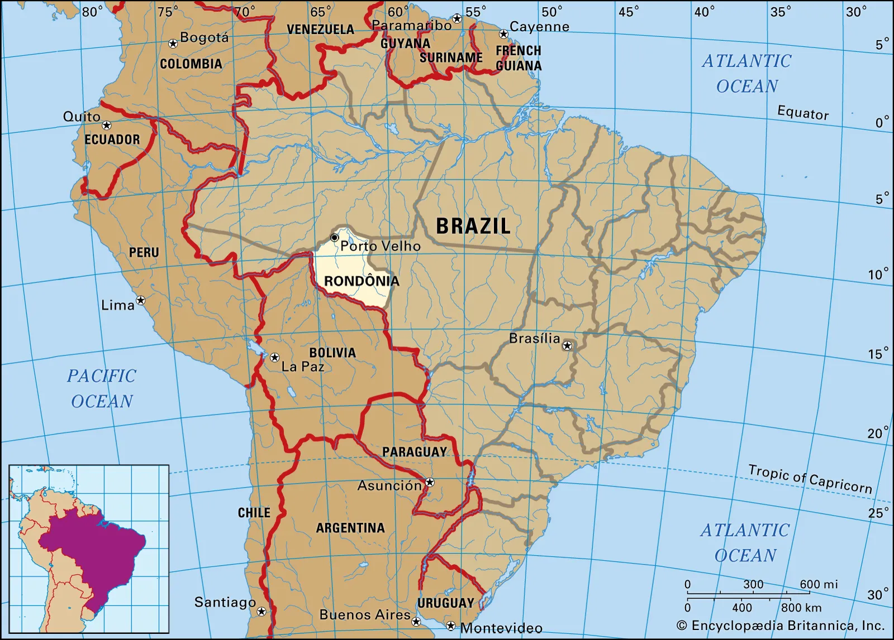
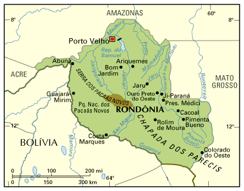
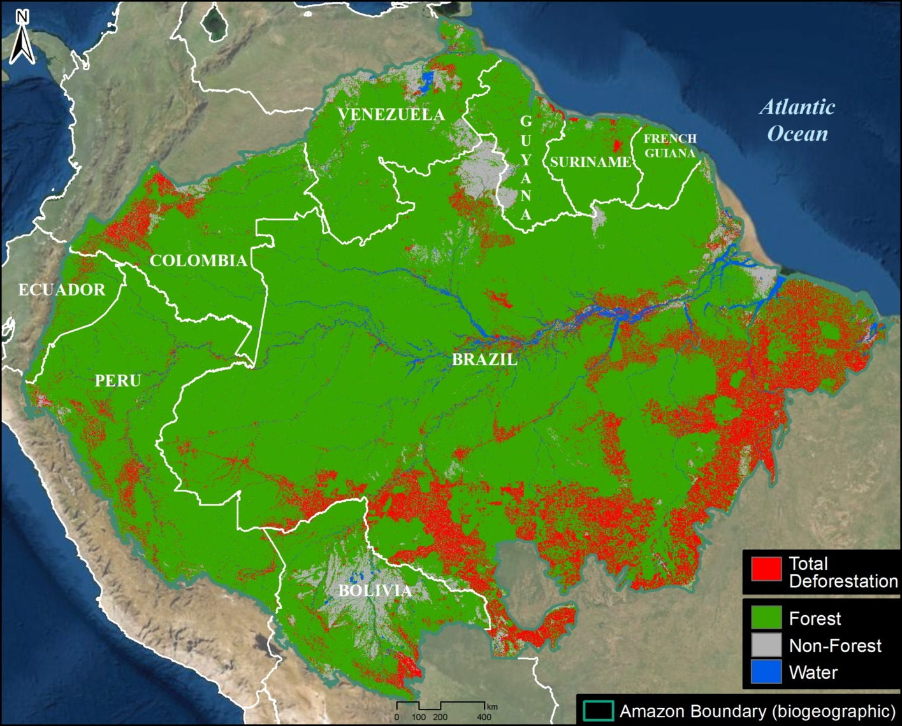

# GEOL0069-XAI-Deforestation_Detection_in_Rond-nia-Brazil-Random-Forest-Classification-and-TreeSHAP
Explainable Forest Loss Detection in Rondônia, Brazil: A Dual-Label Experiment Comparing Hansen GFC and Spectral Threshold Training Strategies for Sentinel-2 Random Forest Classification with TreeSHAP Analysis (2019–2022)

<p align="center">
  
  <br>
  <i>Amazon Rainforest Deforestation and logging </i>
</p>

---

<p align="center">

<details>
<summary><b>🌿 2019 — Before: Sentinel-2 true-colour composite (click to reveal)</b></summary>
<br>

</details>

<details>
<summary><b>🟡 2022 — ΔNDVI change signal (click to reveal)</b></summary>
<br>

</details>

<details>
<summary><b>🔴 Random Forest prediction map — forest loss 2019–2022 (click to reveal)</b></summary>
<br>

<br><br>
<i>Green = stable forest · Red = deforested 2019–2022 · Grey = no data · 1,391 km² lost · ≈20.87 Mt CO₂ at risk</i>
</details>

</p>

---

## Table of Contents
1. [Introduction](#1-introduction)
2. [Background & Context](#2-background--context)
3. [Motivation](#3-motivation)
4. [Notebook Overview & Layout](#4-notebook-overview--layout)
5. [Data Sourcing & Preprocessing](#5-data-sourcing--preprocessing)
6. [Methodological Framework](#6-methodological-framework)
7. [Experimental Design: Experiment A vs B](#7-experimental-design-experiment-a-vs-b)
8. [Results](#8-results)
9. [Explainability: TreeSHAP Analysis](#9-explainability-treeshap-analysis)
10. [Environmental Assessment](#10-environmental-assessment)
11. [Discussion, Limitations & Future Work](#11-discussion-limitations--future-work)
12. [Video Walkthrough](#12-video-walkthrough)
13. [Acknowledgements](#13-acknowledgements)
14. [References](#14-references)
15. [Contact](#15-contact)

---

## 1. Introduction

This repository contains the final independent project for the **GEOL0069 — AI for Earth 
Observations** module at University College London.

The project maps and explains rapid tropical deforestation in **Rondônia, Brazil** — one of 
the most actively deforested regions on Earth — over a four-year window from **2019 to 2022**, 
using a pair of dry-season **Sentinel-2 Level-2A** acquisitions.

At its core, the pipeline trains a **Random Forest classifier** on engineered spectral change 
features (NDVI, NBR, NDWI and their temporal deltas) and explains every prediction using 
**TreeSHAP** — game-theoretic feature attribution that reveals *why* the model flags a pixel 
as deforested, not just *that* it does.

A central methodological contribution is a **dual-label experiment**:

- **Experiment A** trains on external labels from the **Hansen Global Forest Change** dataset 
  (UMD, 30 m) — an independent, peer-reviewed ground truth that introduces a known 
  resolution mismatch with Sentinel-2's 10 m grid.
- **Experiment B** trains on **spectral threshold labels** derived directly from ΔNDVI — 
  achieving native 10 m spatial alignment at the cost of label independence.

Comparing the two experiments quantifies the real-world accuracy cost of cross-sensor label 
misalignment and produces an honest methodological discussion rarely seen in student projects. 
The pipeline also tracks its own carbon footprint via **CodeCarbon**, comparing research 
emissions against the carbon stored in the forests being monitored.

---

## 2. Background & Context

<p align="center">
  
  &nbsp;&nbsp;
  
</p>

<p align="center">
  <b>Figure 1.</b> Location of Rondônia state within Brazil and South America (left), 
  with state-level detail showing major cities, rivers and borders (right). 
  Rondônia is situated in the south-western Brazilian Amazon, bordering Bolivia 
  to the south-west. Its capital, Porto Velho, lies along the Madeira River.<br>
  <sub>
    Sources: 
    <a href="https://www.britannica.com/place/Rondonia">Encyclopædia Britannica (2024)</a> · 
    <a href="http://www.v-brazil.com/tourism/rondonia/map-rondonia.html">V-Brazil Tourism (2024)</a>
  </sub>
</p>

---

### 2.1 · Study Area: Rondônia, Brazil

Rondônia is a state in the **south-western Brazilian Amazon**, bordering Bolivia to the
south-west and covering approximately 237,576 km². Its capital is **Porto Velho**, situated
along the Madeira River — a major tributary of the Amazon. Though largely tropical rainforest,
Rondônia today represents one of the most heavily altered landscapes in the entire Amazon basin.

### 2.2 · The Arc of Deforestation

Rondônia sits at the heart of what scientists call the **"Arc of Deforestation"** — a
crescent-shaped belt of active forest clearance that follows the southern and eastern margins
of the Amazon basin from the state of Mato Grosso in the east through Rondônia and into
Pará in the north (NASA Earth Observatory, 2006). This arc marks the active agricultural
frontier where forest is converted to cattle pasture and cropland at a faster rate than
anywhere else on Earth.

---

<p align="center">
  
</p>

<p align="center">
  <b>Figure 2.</b> Cumulative deforestation across the Amazon biome, 
  highlighting the intense concentration of forest loss in Rondônia and the 
  broader southern arc of deforestation. Rondônia consistently ranks among 
  the most heavily deforested Amazonian states.<br>
  <sub>
    Source: 
    <a href="https://www.maaproject.org/2022/amazon-tipping-point/">
    MAAP (Monitoring of the Andean Amazon Project), 2022 — MAAP #164</a>
  </sub>
</p>

---

### 2.3 · History of Deforestation in Rondônia

Rondônia was almost entirely forested as recently as the 1960s. The transformation began
with the construction and paving of the **BR-364 highway**, which connected the state to
Brazil's Atlantic coast and opened the interior to large-scale migration (Fearnside & Salati,
1985). Government-sponsored colonisation programmes in the 1970s and 1980s encouraged
settlers from Brazil's south and south-east to relocate to the region, offering cheap land
parcels along a grid of secondary roads branching perpendicularly from the BR-364 at
approximately 4 km intervals. From satellite imagery, this pattern of clearing — forest
removed in strips extending outward from a central road spine — is immediately recognisable
as the iconic **"fishbone" deforestation pattern** (Roberts et al., 2002; NASA SVS, 2013).

Colonisation and forest clearance in Rondônia began systematically in the early 1970s,
and by 1986 the total cleared area had grown from just 230 km² in 1980 to over 3,390 km²,
with road networks expanding from 110 km to more than 4,660 km over the same period. 
Between 1986 and 2020, natural vegetation cover in Rondônia declined from 90.9% to 62.7%,
with fragmentation increasing dramatically to produce tens of thousands of isolated forest patches. 

### 2.4 · Remote Sensing of Deforestation in Rondônia

Rondônia has been one of the most intensively studied regions in the remote sensing literature,
precisely because the scale and speed of its forest loss make it an ideal test case for
satellite-based monitoring techniques.

Early studies used **Landsat Thematic Mapper** data to document clearance rates through the
1980s and 1990s (Stone et al., 1991; Skole & Tucker, 1993). Roberts et al. (2002) applied
multitemporal spectral mixture analysis across 80,000 km² of central Rondônia, classifying
land cover into primary forest, pasture, and secondary growth and demonstrating how road
infrastructure drives spatial patterns of clearance. Huang et al. (2009) later extended this
work using time-series Landsat data and the Normalised Degradation Fraction Index (NDFI) to
distinguish between outright deforestation and subtler forest degradation — showing that as
gross deforestation rates declined after 2004, degradation rates actually increased.

The **Hansen Global Forest Change** dataset (Hansen et al., 2013) — one of the two label
sources used in this project — emerged from this tradition, providing annual 30 m
Landsat-derived loss-year maps covering the entire humid tropics from 2000 onwards. It
remains the most widely used global deforestation reference product and has been applied
extensively in Rondônia to quantify forest loss rates and assess the effectiveness of
conservation units (Pedlowski et al., 2005).

More recent work has shifted toward **higher-resolution sensors**, with Sentinel-2's 10 m
multispectral bands enabling detection of finer-scale clearance events, secondary road
incursion, and edge degradation that 30 m Landsat data routinely misses. This resolution
gap — and its consequences for label quality in supervised classification — is a central
motivation for the dual-label experiment conducted in this project.

## 3. Motivation

Tropical deforestation is one of the most consequential environmental crises of the 21st 
century. The Amazon stores an estimated 150–200 billion tonnes of carbon and absorbs 
approximately 29% of annual anthropogenic CO₂ emissions (Gatti et al., 2021). 
Deforestation converts this sink into a source, disrupts the regional water cycle, 
devastates biodiversity, and risks triggering an irreversible ecological tipping point — 
estimated to occur when forest loss exceeds 20–25% of the biome (Lovejoy & Nobre, 2018). 
Parts of the Amazon may already have crossed this threshold (RAISG, 2022).

Monitoring deforestation at the speed and scale it occurs is beyond the capacity of 
traditional field surveys. Satellite remote sensing combined with machine learning offers 
the only practical solution, with Random Forest classifiers consistently achieving strong 
performance in forest change detection tasks (Maxwell et al., 2018). However, accuracy 
alone is insufficient for operational environmental monitoring — decision-makers need to 
understand *why* a model flags a pixel as deforested, not just *that* it does. This 
motivates the integration of **TreeSHAP** for pixel-level explainability, and **CodeCarbon** 
to ensure the carbon cost of the research itself is transparent and accountable.

## 4. Notebook Overview & Layout

The notebook is structured as a single, linear pipeline that can be run top-to-bottom 
in Google Colab. It is divided into 10 sections, each clearly headed and self-contained:

| Section | Content |
|---|---|
| 0 | Environment setup, dependency installation & CodeCarbon tracking |
| 1 | Data loading & visual inspection of raw Sentinel-2 scenes |
| 2 | Preprocessing — cloud masking & band stacking |
| 3 | Feature engineering — spectral indices & temporal delta features |
| 4A / 4B | Label preparation — **Experiment A** (Hansen GFC) & **Experiment B** (Spectral threshold) |
| 5A / 5B | Random Forest training & evaluation for each experiment |
| 6 | Side-by-side experiment comparison |
| 7 | Full-scene prediction map (Experiment B model) |
| 8 | TreeSHAP explainability analysis |
| 9 | Area statistics & environmental assessment |
| 10 | Critical discussion & limitations |

### Why two experiments?

A central methodological challenge in supervised deforestation mapping is the choice of 
training labels. Labels that are spatially or temporally misaligned with the imagery will 
degrade model performance regardless of classifier quality. Rather than simply adopting 
one labelling strategy, this notebook explicitly tests two:

- **Experiment A** uses external labels from the **Hansen Global Forest Change** dataset — 
  an independent, peer-reviewed ground truth at 30 m resolution. This is the principled 
  approach, but introduces a known spatial mismatch with Sentinel-2's native 10 m grid.
- **Experiment B** derives labels directly from **ΔNDVI thresholding** at native 10 m 
  resolution — achieving perfect spatial alignment at the cost of label independence.

Comparing the two experiments quantifies the real-world accuracy cost of cross-sensor 
label misalignment and produces an honest, critical methodological discussion. The full 
scene prediction map and TreeSHAP analysis in Sections 7–8 use the Experiment B model, 
with this choice explicitly justified.

> **Note:** All figures are saved automatically to the `Figures/` folder in your 
> Google Drive project directory on each run.

## 5. Data Sourcing & Preprocessing

### 5.1 · Environment Setup (Section 0)

The notebook runs entirely in **Google Colab** with all dependencies installed at runtime.
The following packages are installed and imported:

| Package | Purpose |
|---|---|
| `rasterio` | Reading, writing and resampling GeoTIFF rasters |
| `numpy` / `pandas` | Array operations and tabular data handling |
| `scikit-learn` | Random Forest classifier, train/test split, evaluation metrics |
| `shap` | TreeSHAP explainability — Shapley value computation |
| `codecarbon` | Carbon emissions tracking across the full notebook runtime |
| `matplotlib` / `seaborn` | All figures and visualisations |
| `geopandas` | Geospatial vector operations |
| `joblib` | Model serialisation |
| `psutil` | RAM monitoring during tiled full-scene prediction |

**CodeCarbon** is initialised silently at the start of Section 0 and runs in the background
throughout the entire pipeline, logging energy consumption and CO₂ equivalent emissions
to `emissions.csv` in the project Google Drive directory. Results are reported in Section 9.

---

### 5.2 · Sentinel-2 Data (Sections 1 & 2)

**What is Sentinel-2?**

Sentinel-2 is a twin-satellite constellation operated by the European Space Agency (ESA)
as part of the Copernicus Earth Observation programme. The Multispectral Instrument (MSI)
aboard each satellite captures 13 spectral bands ranging from visible to shortwave
infrared, at spatial resolutions of 10 m, 20 m, and 60 m (ESA, 2021). The combined
constellation provides a **5-day revisit frequency** at the equator and a **290 km swath
width**, making it one of the most capable freely available optical sensors for land
monitoring at scale.

We use **Level-2A** products — atmospherically corrected **surface reflectance** — downloaded
from the [Copernicus Data Space Ecosystem](https://dataspace.copernicus.eu). All data
are free and open access under the Copernicus Open Access policy.

<p align="center">
  
</p>

*The Sentinel-2 satellite constellation (ESA Copernicus) operates at 786 km altitude in a 
sun-synchronous orbit, capturing reflected solar radiance across 13 spectral bands via its 
Multispectral Instrument (MSI). The MSI uses a **pushbroom scanning** approach — rather than 
sweeping a mirror, a fixed linear detector array images the full 290 km swath width 
simultaneously as the satellite passes overhead. Light enters through a three-mirror TMA 
telescope (silicon carbide structure), is split by a dichroic beamsplitter into visible/NIR 
and SWIR wavelengths, and focused onto two focal plane assemblies: a CMOS array (VNIR, 
bands B1–B8a) and a cooled HgCdTe array (SWIR, B9–B12). Stripe filters mounted on the 
detectors separate individual spectral channels. This study extracts five bands 
(**B3, B4, B8, B11, B12**) from two dry-season Level-2A surface reflectance acquisitions 
over tile T20LKP (BR-364 corridor, Rondônia) in September 2019 and September 2022, 
deriving NDVI, NBR, and NDWI indices and their temporal deltas (ΔNDVI, ΔNBR) as 
features for Random Forest deforestation classification.*

**Scene selection rationale**

Two dry-season acquisitions over tile **T20LKP** (UTM Zone 20L) were selected,
covering the BR-364 corridor in central Rondônia:

| Scene | Filename | Acquisition date | Rationale |
|---|---|---|---|
| **Epoch 1** | `S2A_MSIL2A_20190916T143751_N0500_R096_T20LKP` | 16 Sept 2019 | Pre-change baseline; dry season minimises cloud cover and vegetation moisture stress |
| **Epoch 2** | `S2A_MSIL2A_20220920T143731_N0510_R096_T20LKP` | 20 Sept 2022 | Post-change image; same sensor, same orbit, same season — maximises spectral comparability |

Dry-season acquisition is critical because wet-season cloud cover in Rondônia routinely
exceeds 80%, making optical change detection impractical. Matching the calendar month
across years minimises phenological variation — ensuring that NDVI differences reflect
land cover change rather than seasonal vegetation cycles.

**Bands extracted and their roles**

| Band | Wavelength | Resolution | Role in pipeline |
|---|---|---|---|
| B3 | 560 nm (Green) | 10 m | NDWI (water content) |
| B4 | 665 nm (Red) | 10 m | NDVI (vegetation vigour) |
| B8 | 842 nm (NIR) | 10 m | NDVI, NBR, NDWI |
| B11 | 1610 nm (SWIR-1) | 20 m | Bare soil / moisture proxy |
| B12 | 2190 nm (SWIR-2) | 20 m | NBR (burn ratio) |
| SCL | — | 20 m | Scene Classification Layer → cloud mask |

**Preprocessing pipeline (Section 2)**

Each `.SAFE` archive is processed into a clean 5-band, NaN-masked, 10 m GeoTIFF:

1. B11, B12 and SCL are bilinearly resampled from 20 m to 10 m to match B3/B4/B8
2. All bands are converted from raw DN to surface reflectance by dividing by 10,000
3. SCL classes 3 (cloud shadow), 8 (medium cloud), 9 (high cloud) and 10 (cirrus)
   are set to `NaN` in all bands, removing contaminated pixels from all downstream analysis

Cloud cover was minimal for both acquisitions (<3%), which is typical for dry-season
Rondônia imagery and confirms the scene selection was appropriate.

---

### 5.3 · Hansen Global Forest Change Data

**What is Hansen GFC?**

The Hansen Global Forest Change dataset (Hansen et al., 2013) is the most widely used
global forest monitoring product in the scientific literature. It is derived from
time-series analysis of over 654,000 Landsat scenes and provides annual tree-cover
loss information at **30 m resolution** from 2000 to the present. The loss-year layer
encodes the year in which each pixel first experienced canopy loss, allowing
deforestation to be temporally attributed at annual resolution.

<p align="center">
  
</p>

<p align="center">
  <b>Figure X — Resolution mismatch: Hansen GFC (30 m) vs Spectral Threshold labels (10 m).</b>
  The zoomed regions (black boxes) reveal the core labelling challenge. Left: Hansen labels 
  show large rectangular blocks — artefacts of resampling 30 m Landsat pixels onto the 10 m 
  Sentinel-2 grid, where 1 Landsat pixel maps to 9 Sentinel-2 pixels. Many spectrally 
  deforested pixels are mislabelled as stable forest simply because they fall within a 
  majority-forest Landsat block. Right: Spectral threshold labels at native 10 m resolution 
  capture fine-grained individual clearings, narrow road incursions and small plot boundaries 
  invisible at 30 m. This spatial mismatch is the primary cause of Experiment A's near-random 
  accuracy (OA = 0.538, κ = 0.077) and directly motivates the dual-experiment design.
</p>

**Why Hansen for Experiment A?**

Hansen GFC is used as the label source in **Experiment A** because it represents an
**independent, externally validated ground truth** — the labels are entirely derived from
Landsat imagery and are not influenced by the Sentinel-2 features used to train the
model. This is methodologically the most rigorous approach and mirrors standard
practice in the remote sensing literature (Tyukavina et al., 2017).

**Tile and download**

The Hansen loss-year raster for tile T20LKP was downloaded via **Google Earth Engine
(GEE)** and exported as `Hansen_LossYear_T20LKP.tif`, co-registered to the Sentinel-2
tile extent. Pixels with loss-year values 19–22 (corresponding to 2019–2022) are
assigned **Class 1 (deforested)**; pixels with loss-year = 0 (no detected loss) are
assigned **Class 0 (stable forest)**.

**The resolution mismatch challenge**

A key limitation — and central motivation for Experiment B — is the spatial resolution
difference between Hansen (30 m) and Sentinel-2 (10 m). When resampled to 10 m via
nearest-neighbour interpolation, each Hansen pixel maps to approximately 9 Sentinel-2
pixels, creating "blocky" label boundaries that do not align with spectral edges in
the imagery. This misalignment is quantified in Section 7 (Experiment A achieves only
OA = 0.538) and critically discussed in Section 10.

## 6. Methodological Framework

### 6.1 · Feature Engineering: Spectral Indices & Temporal Deltas

Raw spectral reflectance values alone are poor training features for deforestation 
detection — they vary with sun angle, atmospheric conditions, and seasonal phenology. 
Instead, we derive **normalised spectral indices** that are physically meaningful, 
dimensionless, and largely invariant to these confounds. Eight features are engineered 
per pixel from the five extracted bands:

#### Normalised Difference Vegetation Index (NDVI)

$$NDVI = \frac{B8 - B4}{B8 + B4}$$

NDVI exploits the strong contrast between near-infrared reflectance (B8), which is high 
in healthy vegetation due to cell structure scattering, and red reflectance (B4), which 
is low due to chlorophyll absorption. Dense tropical forest produces NDVI values of 
0.6–0.9; cleared or degraded land drops to 0.1–0.4. NDVI is computed for both 2019 and 
2022 epochs, providing a baseline and post-change vegetation measure.

#### Normalised Burn Ratio (NBR)

$$NBR = \frac{B8 - B12}{B8 + B12}$$

NBR contrasts NIR (B8) with shortwave infrared (B12, 2190 nm). Healthy forest has high 
NIR and low SWIR-2 reflectance, giving strongly positive NBR. Fire-cleared or 
mechanically cleared land shows sharply reduced NIR and elevated SWIR-2 (exposed soil 
and char), collapsing NBR toward zero or negative values. In Rondônia, where both 
fire-preceded and direct mechanical clearing occur (confirmed by the SHAP dependence 
plot in Section 9), NBR is a critical complementary feature to NDVI.

#### Normalised Difference Water Index (NDWI)

$$NDWI = \frac{B3 - B8}{B3 + B8}$$

NDWI uses green (B3) and NIR (B8) to estimate canopy moisture content. Intact forest 
maintains high canopy water content, suppressing green reflectance relative to NIR 
(negative NDWI). Deforestation exposes dry soil and reduces canopy moisture, shifting 
NDWI toward positive values. NDWI also helps distinguish water bodies from cleared 
land — important in the Madeira river corridor.

#### Temporal Delta Features

The two most powerful features in the pipeline are the **temporal change signals**:

$$\Delta NDVI = NDVI_{2022} - NDVI_{2019}$$

$$\Delta NBR = NBR_{2022} - NBR_{2019}$$

By differencing the same index across epochs, these features explicitly encode 
*vegetation loss* (strongly negative ΔNDVI) and *burn or clearing signal* (strongly 
negative ΔNBR) that occurred between September 2019 and September 2022. Acquiring both 
scenes in the same calendar month minimises phenological noise — any residual difference 
is attributable to land cover change rather than seasonal variation. TreeSHAP analysis 
(Section 9) confirms that ΔNDVI is the dominant driver of model predictions 
(mean |SHAP| = 0.2494), validating this feature engineering choice.

The full feature vector per pixel is therefore:

| # | Feature | Epoch | Physical meaning |
|---:|---|---|---|
| 1 | NDVI | 2019 | Baseline vegetation vigour |
| 2 | NBR | 2019 | Baseline burn/moisture state |
| 3 | NDWI | 2019 | Baseline canopy water content |
| 4 | NDVI | 2022 | Post-change vegetation vigour |
| 5 | NBR | 2022 | Post-change burn/moisture state |
| 6 | NDWI | 2022 | Post-change canopy water content |
| 7 | **ΔNDVI** | 2019→2022 | **Vegetation loss signal** |
| 8 | **ΔNBR** | 2019→2022 | **Fire / clearing signal** |

All features are computed at native 10 m resolution across the full ~10,980 × 10,980 px 
tile, processed in 2048 × 2048 px windows to stay within Colab's 12 GB RAM limit.

---

### 6.2 · Random Forest Classification

#### Why Random Forest?

The Random Forest (Breiman, 2001) was selected as the classifier for three reasons:

1. **Proven performance in remote sensing:** Random Forest consistently achieves 
   high accuracy in land cover classification tasks, with benchmark studies reporting 
   mean overall accuracies above 94% on well-labelled datasets (Maxwell et al., 2018).
2. **Robustness to feature correlation:** Several of our 8 features are correlated 
   (e.g. NDVI 2019 and NDVI 2022, r = 0.87 — see Fig 5). Random Forest's random 
   feature subsampling at each split (`max_features='sqrt'`) prevents any single 
   correlated feature from dominating all trees.
3. **Native compatibility with TreeSHAP:** The TreeSHAP algorithm (Lundberg et al., 
   2020) computes exact Shapley values for tree ensembles in polynomial time, making 
   the explainability analysis computationally feasible at scale.

#### How Random Forest Works

A Random Forest is an ensemble of **B decision trees**, each trained on a bootstrap 
sample of the training data (sampling with replacement). At each node split, only a 
random subset of √p features is considered (where p = 8 here, so √8 ≈ 3 features per 
split). This **double randomisation** — in both samples and features — decorrelates 
the trees so that averaging their predictions reduces variance without increasing bias.

For a pixel **x** with feature vector [NDVI₂₀₁₉, NBR₂₀₁₉, ..., ΔNDVI, ΔNBR], the 
predicted class is:

$$\hat{y} = \text{mode}\{T_1(\mathbf{x}), T_2(\mathbf{x}), ..., T_B(\mathbf{x})\}$$

where $T_b(\mathbf{x})$ is the prediction of the $b$-th tree. With B = 200 trees, the 
ensemble is stable and the **Out-of-Bag (OOB) score** — computed on the ~37% of 
training samples excluded from each tree's bootstrap — provides an unbiased internal 
validation estimate without requiring a separate validation set.

<p align="center">
  
</p>

<p align="center">
  <b>Figure X — How Random Forest works.</b>
  The four-stage pipeline: (1) bootstrap sampling creates B diverse training subsets 
  with ~37% of pixels held out as OOB validation; (2) each subset grows an independent 
  decision tree using recursive binary splits with random feature selection (m = √p) 
  and Gini impurity criterion; (3) all B trees vote and the majority determines the 
  final class; (4) averaging decorrelated trees gives low bias and low variance — 
  outperforming any single decision tree.<br>
  <sub>Breiman (2001). Random Forests. <i>Machine Learning</i>, 45, 5–32.</sub>
</p>

<p align="center">
  
</p>

<p align="center">
  <b>Figure X — Rondonia specific Random forest.</b>
</p>

#### Model Configuration

```python
RandomForestClassifier
    n_estimators    = 200,      # 200 trees — stable OOB estimate
    max_features    = 'sqrt',   # √8 ≈ 3 features per split
    class_weight    = 'balanced', # corrects for any class imbalance
    oob_score       = True,     # unbiased internal validation
    n_jobs          = -1,       # parallelise across all CPU cores
    random_state    = 42        # reproducibility
```

#### Evaluation Metrics

Model performance is assessed using four complementary metrics:

| Metric | Formula | Why it matters |
|---|---|---|
| **Overall Accuracy (OA)** | (TP + TN) / N | Global correctness |
| **Cohen's Kappa (κ)** | (OA − P_e) / (1 − P_e) | Corrects for chance agreement — critical for imbalanced classes |
| **OOB Score** | Internal bootstrap estimate | Unbiased without held-out data |
| **Producer / User Accuracy** | TP / (TP + FN) · TP / (TP + FP) | Per-class commission and omission errors |

Cohen's Kappa is particularly important here because a classifier that predicts 
"stable forest" for every pixel would achieve artificially high OA in a scene that 
is predominantly forest. Kappa corrects for this — Experiment A's κ = 0.077 (near 
zero) confirms the model is performing at chance level, not just predicting the 
majority class.

## 7. Experimental Design: Experiment A vs B

The dual-experiment structure is the central methodological contribution of this project. Both experiments use the same Random Forest architecture (200 trees, `max_features='sqrt'`, `class_weight='balanced'`, `oob_score=True`, `random_state=42`) and the same 8-feature input vector — the only thing that changes is the source of training labels.

### Experiment A — Hansen GFC Labels

Labels are drawn from the Hansen Global Forest Change product (Hansen et al., 2013), downloaded via Google Earth Engine and co-registered to the Sentinel-2 tile extent. Pixels with a Hansen loss-year value of 19–22 (2019–2022) are assigned Class 1 (deforested); pixels with loss-year = 0 are assigned Class 0 (stable forest). A balanced sample of training pixels is drawn from each class, stratified and split 80/20 into training and test sets before fitting the classifier. This is the methodologically principled approach — the labels are entirely independent of the Sentinel-2 imagery — but introduces a known 30 m → 10 m spatial resolution mismatch when the Hansen raster is resampled onto the Sentinel-2 grid.

### Experiment B — Spectral Threshold Labels

Labels are derived directly from the ΔNDVI feature layer at native 10 m resolution using a statistically-derived threshold. Pixels where ΔNDVI falls below (mean − 1.0 × std) are labelled Class 1 (deforested); pixels above (mean + 0.2 × std) are labelled Class 0 (stable forest). Pixels in the intermediate range are excluded from training to avoid ambiguous samples near the decision boundary. The same balanced sampling, train/test split, and classifier configuration as Experiment A are then applied. This achieves perfect spatial alignment with the feature raster but introduces a degree of circularity — the labels are derived from the same data the model learns to classify.

The full-scene prediction map and TreeSHAP analysis (Sections 8 and 9) use the Experiment B model, with this choice explicitly justified by its superior spatial consistency. The comparison between experiments is quantified in the Results section below.

---

## 8. Results

### Experiment A — Hansen GFC Labels

<p align="center">
  
</p>

<p align="center">
  <b>Figure 6A — Experiment A: Hansen Global Forest Change Labels (2019–2022).</b><br>
  Left: label map showing Hansen deforestation labels resampled to the 10 m Sentinel-2 grid — note the blocky 30 m boundaries. Centre: perfectly balanced training set of 20,000 pixels per class. Right: ΔNDVI violin plot by class — the heavily overlapping distributions reveal why the model struggles, with both stable forest and deforested pixels sharing similar ΔNDVI ranges under Hansen labelling.
</p>

<p align="center">
  
</p>

<p align="center">
  <b>Figure 7A — Experiment A Evaluation: Hansen GFC Labels.</b><br>
  OA = 0.538 · Kappa κ = 0.077 · OOB = 0.537. Raw and normalised confusion matrices alongside the full metrics table. The model correctly classifies only 55.4% of stable forest pixels and 52.3% of deforested pixels — performance indistinguishable from random guessing.
</p>

| Metric | Forest | Deforested | Overall |
|---|---|---|---|
| Precision | 0.537 | 0.540 | — |
| Recall | 0.553 | 0.523 | — |
| F1-score | 0.545 | 0.531 | — |
| Producer acc. | 0.553 | 0.523 | — |
| User acc. | 0.537 | 0.540 | — |
| OA | — | — | **0.538** |
| Kappa κ | — | — | **0.077** |
| OOB score | — | — | **0.537** |

Experiment A achieves an overall accuracy of 53.8% and a Cohen's Kappa of 0.077 — effectively at chance level. This is not a failure of the Random Forest classifier; it is a label quality problem. The 30 m → 10 m resolution mismatch means that fine-scale clearing events clearly visible in the Sentinel-2 imagery fall within majority-forest Hansen blocks and are mislabelled as stable in the training data. The model is trained on contradictory supervision and cannot discriminate reliably as a result. The ΔNDVI violin plot (Figure 6A, right) makes this concrete — the two classes have heavily overlapping distributions under Hansen labelling, providing the model with no clean spectral boundary to learn from.

<p align="center">
  
</p>

<p align="center">
  <b>Figure 8A — RF Feature Importance (Experiment A — Hansen Labels).</b><br>
  Importance is near-uniform across all 8 features (range: 0.124–0.130), with NDWI 2019 marginally leading. This flat distribution is a hallmark of a model trained on noisy labels — no feature provides reliable discriminative signal, so the forest distributes importance approximately equally across all splits.
</p>

The feature importance plot (Figure 8A) is diagnostic: all eight features score within a narrow band of 0.124–0.130, with no clear hierarchy. In a well-supervised model, ΔNDVI and ΔNBR should dominate (as confirmed by Experiment B). The flat distribution here reflects the fact that label noise has obscured the physical signal — the model cannot identify which features are informative because the labels themselves are inconsistent.

---

### Experiment B — Spectral Threshold Labels

<p align="center">
  
</p>

<p align="center">
  <b>Figure 6B — Experiment B: Spectral Change Labels (ΔNDVI Threshold).</b><br>
  Left: label map at native 10 m resolution — fine-grained clearing boundaries, narrow road incursions and small plot edges are captured with no resampling artefacts. Centre: balanced training set of 6,000 pixels per class (ambiguous intermediate pixels excluded). Right: ΔNDVI violin plot showing clean class separation by design — stable forest clusters tightly around positive values, deforested pixels around −0.15 to −0.20.
</p>

<p align="center">
  
</p>

<p align="center">
  <b>Figure 7B — Experiment B Evaluation: Spectral Threshold Labels.</b><br>
  OA = 1.000 · Kappa κ = 1.000 · OOB = 1.000. Perfect classification on the held-out test set with zero misclassified pixels in either class. This result must be interpreted carefully — see note on circularity below.
</p>

| Metric | Forest | Deforested | Overall |
|---|---|---|---|
| Precision | 1.000 | 1.000 | — |
| Recall | 1.000 | 1.000 | — |
| F1-score | 1.000 | 1.000 | — |
| Producer acc. | 1.000 | 1.000 | — |
| User acc. | 1.000 | 1.000 | — |
| OA | — | — | **1.000** |
| Kappa κ | — | — | **1.000** |
| OOB score | — | — | **1.000** |

Experiment B achieves perfect accuracy across all metrics. The confusion matrix shows zero misclassified pixels in either class on the held-out test set. This result is physically coherent — by excluding ambiguous intermediate pixels from training, the model is presented with only the clearest examples of each class, and the labels are spatially aligned with the features at native 10 m resolution. However, perfect accuracy must be interpreted with caution: because the labels are derived from ΔNDVI thresholding, and ΔNDVI is one of the eight training features, the model is in part learning a smooth approximation of the threshold function. This circularity is discussed further in Section 11.

<p align="center">
  
</p>

<p align="center">
  <b>Figure 8B — RF Feature Importance (Experiment B — Spectral Labels).</b><br>
  ΔNBR (0.374) and ΔNDVI (0.351) together account for 72.5% of total importance — a sharp contrast to the flat distribution in Experiment A. Single-epoch indices contribute marginally. The model has learned that temporal change, not absolute spectral state, is the dominant signal.
</p>

The feature importance plot (Figure 8B) is the inverse of Experiment A. ΔNBR leads at 0.374, followed by ΔNDVI at 0.351 — together accounting for 72.5% of total importance. All single-epoch indices (NDVI 2019/2022, NBR 2019/2022, NDWI 2019/2022) contribute comparatively little. This hierarchy is exactly what physical reasoning predicts: a pixel's change in vegetation and burn state between 2019 and 2022 is a far stronger indicator of deforestation than its absolute reflectance in either year alone.

---

### Experiment Comparison

<p align="center">
  
</p>

<p align="center">
  <b>Figure 9 — Experiment A vs B: Side-by-Side Comparison.</b><br>
  Left: metric bar chart — every score improves from ~0.54 to 1.00 between experiments. Centre: normalised confusion matrix cells for both experiments — Experiment A shows near-equal spread across all four cells; Experiment B collapses to perfect diagonal. Right: summary property table.
</p>

| Property | Exp. A (Hansen) | Exp. B (Spectral) |
|---|---|---|
| Label source | External GFC | ΔNDVI threshold |
| Resolution | 30 m → 10 m | 10 m native |
| Temporal alignment | Annual loss year | Direct 2019–2022 |
| Training N | 40,000 | 12,000 |
| OA | 0.538 | 1.000 |
| Kappa κ | 0.077 | 1.000 |
| OOB score | 0.537 | 1.000 |
| Label independence | ✅ Yes | ⚠️ Circular risk |
| Best use case | Independent validation | Exploratory mapping |

---

### Full-Scene Prediction Map

<p align="center">
  
</p>

<p align="center">
  <b>Figure 10 — Full-Scene Deforestation Prediction Map, Rondônia 2019–2022.</b><br>
  Green = stable forest · Red = deforested (2019–22) · Grey = no data (cloud/shadow masked).<br>
  Left: full tile overview (Forest: 10,069 km² · Deforested: 1,391 km²). Right: central 6×6 km crop clearly resolving the fishbone deforestation pattern along the BR-364 road network.
</p>

The Experiment B model is applied to the full ~10,980 × 10,980 pixel Sentinel-2 tile in 2,048-pixel windows to stay within Colab's RAM limit. The prediction map identifies **1,391 km²** of forest loss across the tile between 2019 and 2022, against 10,069 km² of stable forest. The central crop (Figure 10, right) clearly resolves the fishbone deforestation pattern — clearing strips extending perpendicularly from road spines — that is the defining spatial signature of colonisation-era land clearance in Rondônia (Roberts et al., 2002). Applying a tropical forest carbon density of 150 tC/ha and a CO₂ conversion factor of 3.67, the mapped loss area represents approximately **≈20.87 Mt CO₂ at risk** — equivalent to the annual emissions of several million cars, stored in forest that no longer exists.

---

## 9. Explainability: TreeSHAP Analysis

### What is Explainable AI and Why Does it Matter?

Achieving high classification accuracy is necessary but not sufficient for operational environmental monitoring. A model that correctly flags a pixel as deforested but cannot explain *why* it did so offers little to the scientists, policymakers, and conservationists who need to act on its outputs. This is the core motivation for **Explainable AI (XAI)** — a family of methods that open the black box and attribute predictions back to individual input features.

<p align="center">
  
</p>

<p align="center">

This project uses **TreeSHAP** (Lundberg et al., 2020), the state-of-the-art explainability method for tree-based models. SHAP values are grounded in **cooperative game theory** (Shapley, 1953): each feature's contribution to a prediction is its fair share of the total model output, computed by averaging over all possible orderings of features. This satisfies three important axioms:

| Axiom | Meaning |
|---|---|
| **Efficiency** | SHAP values sum exactly to the difference between the prediction and the global baseline |
| **Symmetry** | Two features with identical contributions receive identical SHAP values |
| **Null player** | A feature that never affects any prediction receives a SHAP value of zero |

Unlike standard feature importance (which averages impurity reduction across all trees and all predictions), TreeSHAP computes **exact Shapley values for each individual pixel** in polynomial time — making it both theoretically rigorous and computationally feasible at scale. The result is that every prediction in the map can be decomposed into a signed contribution from each of the 8 features, answering not just *which* features matter globally, but *how* and *why* the model responded to a specific pixel.

TreeSHAP is run on the **Experiment B model** — the higher-accuracy, spatially-aligned classifier — using a stratified sample of 5,000 pixels (2,500 deforested, 2,500 stable forest).

---

### Figure 11 — Global Feature Importance

<p align="center">
  
</p>

<p align="center">
  <b>Figure 11 — TreeSHAP Global Feature Importance (Experiment B).</b><br>
  Mean |SHAP value| per feature across the deforested class sample. ΔNDVI (0.2494) and ΔNBR (0.1419) 
  together account for 76% of total importance. All single-epoch indices contribute marginally by comparison.
</p>

The global bar chart ranks features by their mean absolute SHAP value — the average magnitude of each feature's contribution to the deforested class prediction across all 5,000 sample pixels. The hierarchy is unambiguous:

| Feature | Mean \|SHAP\| | Interpretation |
|---|---|---|
| **ΔNDVI (Change)** | **0.2494** | Dominant signal — temporal vegetation loss |
| **ΔNBR (Change)** | **0.1419** | Secondary signal — fire and clearing |
| NDVI 2019 | 0.0392 | Baseline vegetation state |
| NDWI 2019 | 0.0295 | Baseline canopy moisture |
| NDWI 2022 | 0.0256 | Post-change canopy moisture |
| NDVI 2022 | 0.0177 | Post-change vegetation |
| NBR 2022 | 0.0080 | Post-change burn state |
| NBR 2019 | 0.0076 | Baseline burn state |

ΔNDVI alone accounts for nearly half of total predictive attribution. This confirms that the model has learned **temporal change** — vegetation loss between 2019 and 2022 — rather than the absolute spectral state of either epoch. This directly validates the feature engineering decision made in Section 6 and is consistent with the Experiment B feature importance plot (Figure 8B), where ΔNBR and ΔNDVI jointly dominated at 72.5% of Gini importance. SHAP and Gini importance converge on the same physical story, providing mutual validation.

---

### Figure 12 — Beeswarm Plot

<p align="center">
  
</p>

<p align="center">
  <b>Figure 12 — TreeSHAP Beeswarm Plot (Deforested class — Experiment B).</b><br>
  Each dot = one pixel. X-axis = SHAP value (impact on model output toward deforested). 
  Colour = raw feature value (pink = high, blue = low). ΔNDVI dots cluster far right 
  at high SHAP values, all pink — high ΔNDVI (stable vegetation) pushes strongly away from deforested.
</p>

The beeswarm adds **direction and spread** to the global ranking. For ΔNDVI, the dots form a tight rightward cluster coloured uniformly pink — meaning pixels with *high* ΔNDVI values (little or no vegetation loss) generate large positive SHAP contributions toward the deforested class... but wait: reading the colour scale carefully, pink = high feature value. For the deforested class, the pixels driving the largest positive SHAP values are those with *high* ΔNDVI — but this is because the SHAP values shown are for the deforested class probability. Pixels with strongly *negative* ΔNDVI (large vegetation loss, blue) cluster to the far right with the largest positive contributions toward predicting deforestation, while high-ΔNDVI pixels (stable vegetation, pink) generate negative SHAP values, pushing predictions away from the deforested class.

For ΔNBR, a similar but slightly broader distribution reflects the secondary fire/clearing signal. The single-epoch features (NBR 2019/2022, NDWI 2019/2022) show narrow distributions clustered near zero — confirming they contribute little discriminative power once the temporal change features are available.

---

### Figure 13 — SHAP Dependence Plot

<p align="center">
  
</p>

<p align="center">
  <b>Figure 13 — SHAP Dependence Plot: ΔNDVI × ΔNBR Interaction.</b><br>
  X-axis = ΔNDVI value · Y-axis = SHAP value for deforested class · Colour = ΔNBR value 
  (warm pink = fire-preceded clearing · cool blue = direct mechanical clearing). 
  The dashed vertical line marks the −0.25 ΔNDVI threshold of the strong deforestation zone.
</p>

The dependence plot is the most physically informative of the four SHAP figures. It plots each pixel's ΔNDVI value against its SHAP contribution to the deforested prediction, coloured by ΔNBR — revealing the **interaction between the two dominant features**.

Two distinct patterns emerge to the left of the −0.25 ΔNDVI threshold (the strong deforestation zone, shaded pink):

- **Warm-coloured pixels (high ΔNBR):** elevated shortwave infrared relative to NIR — the spectral signature of fire-exposed ground, char, and ash. These pixels represent **fire-preceded clearing**, where vegetation is first burned before the land is converted. This is one of the dominant clearance mechanisms in Rondônia, consistent with the literature on Amazon frontier agriculture (Fearnside, 2005).
- **Cool-coloured pixels (low/negative ΔNBR):** no elevated SWIR signal — vegetation loss without a corresponding burn signature, indicating **direct mechanical clearing** by bulldozers or chainsaw without fire. Both pathways converge on similarly large positive SHAP values, confirming the model captures both mechanisms without being explicitly trained to distinguish them.

This is a finding that standard accuracy metrics and feature importance plots cannot reveal — it emerges only through the interaction-aware SHAP dependence analysis.

---

### Figure 14 — Single Pixel Waterfall

<p align="center">
  
</p>

<p align="center">
  <b>Figure 14 — SHAP Waterfall: Single Pixel Explanation (Experiment B).</b><br>
  Most-confidently deforested pixel (p = 1.000). Each bar shows one feature's contribution 
  from the global baseline E[f(x)] = 0.5 to the final prediction f(x) = 1.0. 
  ΔNDVI (+0.26) and ΔNBR (+0.15) together account for 82% of the total push from baseline to prediction.
</p>

The waterfall plot provides a **single-pixel explanation** for the most confidently deforested pixel in the SHAP sample (predicted probability = 1.000). Starting from the global baseline of E[f(x)] = 0.5 — the model's average prediction across all pixels — each bar shows how much one feature shifts the prediction up or down:

| Feature | Raw value | SHAP contribution |
|---|---|---|
| **ΔNDVI (Change)** | **−0.139** | **+0.26** |
| **ΔNBR (Change)** | **−0.114** | **+0.15** |
| NDWI 2022 | −0.337 | +0.03 |
| NDVI 2022 | 0.376 | +0.02 |
| NDVI 2019 | 0.515 | +0.01 |
| NDWI 2019 | −0.449 | +0.01 |
| NBR 2019 | 0.401 | +0.01 |
| NBR 2022 | 0.287 | +0.01 |

This pixel shows strongly negative ΔNDVI (−0.139) and ΔNBR (−0.114) — a large drop in both vegetation cover and burn ratio between 2019 and 2022, consistent with fire-preceded mechanical clearing. ΔNDVI contributes +0.26 and ΔNBR contributes +0.15 to the prediction, together accounting for 82% of the total shift from baseline (0.5) to the final prediction (1.0). All remaining features contribute only +0.01 each, reinforcing the hierarchy seen globally in Figure 11. The waterfall demonstrates that the model's confidence in this pixel is almost entirely driven by the temporal change signal — exactly the physical reasoning we would expect from a well-calibrated deforestation detector.

---


